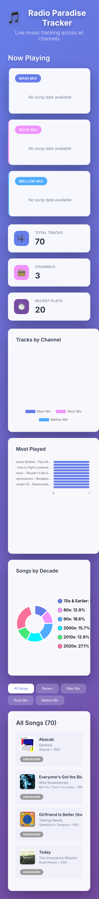
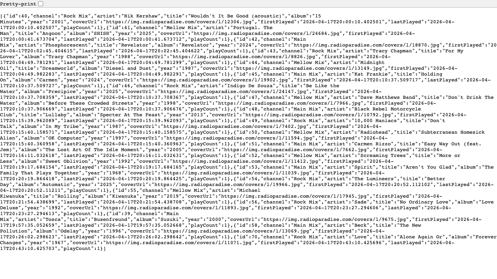

# Radio Paradise Tracker

A Java 21 + Spring Boot application that continuously tracks currently playing songs on Radio Paradise channels and exposes the data through a REST API.

## Features

- Polls Radio Paradise API on a fixed interval (every 30 seconds by default)
- Stores songs in an in-memory H2 database
- Tracks per-song play counts and last played timestamps
- Exposes browsing endpoints for all, recent, most-played, and channel-filtered songs
- Includes H2 Console for local database inspection
- Includes a Vue.js dashboard frontend with charts and channel-based views

## Architecture

- **Backend:** Spring Boot (`src/main/java`)
  - Scheduled polling with `SongTrackerScheduler`
  - External API integration with `RadioParadiseClient`
  - Persistence via Spring Data JPA + H2
- **Frontend:** Vue 3 + Vite (`frontend`)
  - Live dashboard cards for each channel
  - Most-played and distribution charts
  - Filterable song list

## Quick Start

### 1) Start the backend

```bash
./mvnw spring-boot:run
```

Backend runs on `http://localhost:8081`.

### 2) Start the frontend (optional dashboard)

```bash
npm --prefix frontend install
npm --prefix frontend run dev
```

Frontend runs on `http://localhost:3000`.

## API Endpoints

- `GET /api/songs` - List all tracked songs
- `GET /api/songs/recent` - List latest 20 songs by `lastPlayed`
- `GET /api/songs/most-played` - List top 20 songs by `playCount`
- `GET /api/songs/channel/{channelId}` - Filter songs by channel (`0`, `1`, `2`)

### Channel IDs

- `0` -> Main Mix
- `1` -> Rock Mix
- `2` -> Mellow Mix

## Configuration

All core settings are in `src/main/resources/application.properties`:

- `server.port=8081`
- `radioparadise.api.base-url=https://api.radioparadise.com`
- `radioparadise.api.channels=0,1,2`
- `radioparadise.scheduler.fixed-delay=30000`

## H2 Console

- URL: [http://localhost:8081/h2-console](http://localhost:8081/h2-console)
- JDBC URL: `jdbc:h2:mem:radioparadise`
- Username: `sa`
- Password: (empty)

## Screenshots

### Dashboard Overview


### Dashboard Mobile View



### API Response Example (`/api/songs/most-played`)



## Tech Stack

- Java 21
- Spring Boot
- Spring Data JPA
- H2 Database
- Lombok
- Maven
- Vue 3
- Vite
- Chart.js
